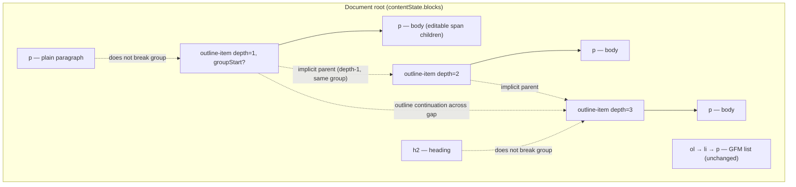
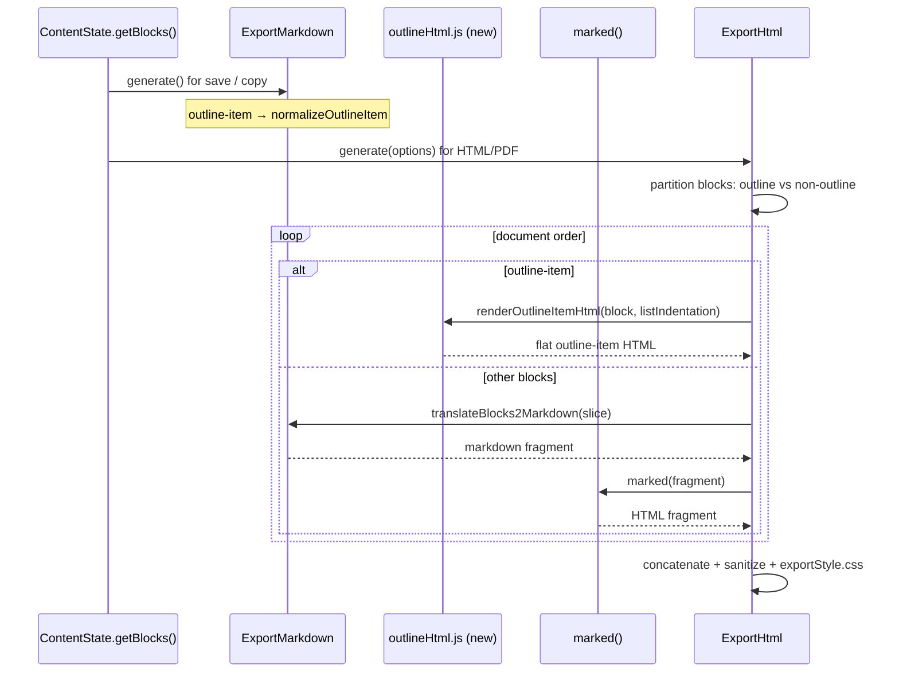

# Design: Academic Outline Editing for MarkText

**Status:** Ready for implementation  
**Audience:** Senior engineers implementing in `packages/muyajs` first  
**Sources:** `.scratch/outline-blocks/PRD.md` (AR-1–AR-11 rollup), `docs/HANDOFF.md`, `CONTEXT.md`, `docs/adr/0001-outline-markdown-serialization.md`  
**Engine:** Production legacy `packages/muyajs` (desktop). TypeScript `@muyajs/core` parity deferred.

---

## Overview

MarkText users writing ministry, legal, and academic study documents need hierarchical outlines where each depth uses a distinct numbering style (Roman → letter → decimal through seven levels) and **Tab promotes the entire block**, not inline spaces or GFM list re-parenting. Today:

- Plain paragraphs: Tab inserts spaces via `insertTab()` in `tabCtrl.js`.
- Ordered lists: one marker style at every depth; nesting follows list rules, not academic outline conventions.
- Manually typed `I.` / `A.` / `1.` prefixes are fragile — they do not survive block-level indent, save/reopen, or print/PDF export.

This design adds **outline items** as a first-class block type in muyajs, gated behind an opt-in preference (`outlineBlocksEnabled`, default `false`). Each item stores **depth** (1–7) and **body text** separately from a **computed structural marker** derived from outline group, implicit parent, and sibling index. Persistence uses **structural markers in markdown** (ADR-0001). HTML/PDF/print uses a **hybrid export seam** so outlines render correctly without rewriting the entire exporter.

The implementation mirrors proven MarkText patterns: ordered-list export (`normalizeListItem`), footnote opt-in gating (lexer + `setOptions` watch), and list keyboard semantics (`enterInEmptyParagraph`, `indentListItem`) — adapted for a **flat** block model with **logical outline groups**.

---

## Goals

| # | Goal |
|---|------|
| G1 | Block-level Tab/Shift+Tab changes outline depth with symmetric reparenting cascade (AR-1). |
| G2 | Enter creates same-depth sibling; empty Enter exits outline structure (AR-4). |
| G3 | Seven fixed marker styles by depth; automatic renumbering on insert/delete/move (AR-1, AR-2). |
| G4 | Markdown round-trip via structural markers + cumulative indent (ADR-0001, AR-2). |
| G5 | Opt-in preference; default-off; footnote-mirror mid-session toggle behavior (AR-5, AR-10). |
| G6 | HTML/PDF/print export with flat `outline-item` markup, correct markers, continuation alignment (AR-9). |
| G7 | Turn Into matrix with outline–list boundary enforced (AR-8). |
| G8 | Unit tests (markdown + HTML) and E2E primary flow per PRD testing decisions. |

## Non-Goals

- TypeScript engine (`packages/muya`) parity or desktop cutover.
- `listIndentation: 'tab'` support (known dead).
- Custom per-user marker sequences; depth beyond 7.
- Direct outline ↔ list Turn Into.
- Detection hints when pref off and file has marker-like lines (AR-10).
- Auto outline on new documents (US-9 dropped, AR-11).
- Mid-session re-import when enabling pref on an open doc.
- Community i18n beyond `en.json` for initial upstream PR.

---

## Proposed Design

### Architecture summary

```
┌─────────────────────────────────────────────────────────────────┐
│ Desktop (packages/desktop)                                      │
│  schema.json → preference.json → editor.vue watch → setOptions  │
│  prefComponents/markdown/index.vue (UI toggle)                  │
└────────────────────────────┬────────────────────────────────────┘
                             │ outlineBlocksEnabled, listIndentation
┌────────────────────────────▼────────────────────────────────────┐
│ muyajs ContentState                                             │
│  tabCtrl / enterCtrl / backspaceCtrl / paragraphCtrl            │
│  pasteCtrl → markdownToState                                    │
│  outlineCtrl (new) — group walk, markers, indent, cascade     │
└────────────┬───────────────────────────────┬────────────────────┘
             │                               │
┌────────────▼────────────┐    ┌─────────────▼────────────────────┐
│ Import/Export Markdown    │    │ WYSIWYG render + export HTML   │
│ marked lexer (gated)      │    │ renderContainerBlock + CSS     │
│ importMarkdown.js         │    │ exportMarkdown.js              │
│ exportMarkdown.js         │    │ exportHtml.js (hybrid seam)    │
└───────────────────────────┘    └────────────────────────────────┘
```

### Block model (flat outline items)

Outline items are **not** `ol`/`li` and **not** wrapped in an `outline-list` container. They sit at the document root alongside paragraphs, headings, lists, etc.



**Logical outline group:** Items share implicit parent/sibling relationships only within the same group. **Outline continuation** spans intervening non-outline blocks. **Outline restart** begins a new group only via explicit user action (WYSIWYG restart command) or `<!-- mt:outline-group-start -->` sentinel in markdown — never from intervening content alone.

**Implicit parent:** Nearest preceding outline item at depth − 1 in the same group.  
**Outline siblings:** Same depth + same implicit parent in the same group; marker index resets per parent.

### Marker computation

Fixed sequence by depth (from `CONTEXT.md`):

| Depth | Style | Example |
|-------|-------|---------|
| 1 | Upper Roman | `I.` |
| 2 | Upper Alpha | `A.` |
| 3 | Decimal | `1.` |
| 4 | Lower Alpha | `a.` |
| 5 | Lower Roman | `i.` |
| 6 | Paren Decimal | `(1)` |
| 7 | Paren Lower Alpha | `(a)` |

Markers are **computed** at render/export time from sibling index within the implicit-parent scope. They are **not** stored in body text. WYSIWYG displays markers as non-editable chrome (list-bullet pattern).

**Restart root exception (AR-6):** After group-start sentinel or WYSIWYG restart, honor the written marker on import; set `groupStart: true` and `start` (flat analog of `ol.start`). All other items in the group derive markers from structure.

### Indent model (reuse `listIndentation`)

Reuse existing `listIndentation` preference (`MUYA_DEFAULT_OPTION.listIndentation`, `ExportMarkdown` constructor) — no separate outline indent setting.

Cumulative stacking mirrors `normalizeListItem()` in `exportMarkdown.js`:

- Each depth level adds `parentMarkerWidth + (listIndentationCount − 1)` spaces.
- DFM mode aligns to 4-space grid (same math as lists).
- **Body continuation indent:** continuation lines align under body text after marker (`indent + markerWidth`), matching list subsequent-paragraph behavior.

Import requires **indent + marker style must agree**; mismatch → plain paragraph (AR-2, AR-3).

### Keyboard behavior

#### Tab / Shift+Tab (`tabCtrl.js`)

Insert outline branch **before** `isIndentableListItem()` (~line 513) and **before** `insertTab()`:

```javascript
// tabCtrl.js — insertion point (~512)
if (this.isIndentableOutlineItem()) {
  return event.shiftKey
    ? this.outdentOutlineItem()
    : this.indentOutlineItem()
}
if (this.isIndentableListItem()) {
  return this.indentListItem()
}
return this.insertTab(event)
```

- **Collapsed cursor required** (match `isIndentableListItem` guard).
- **Depth 7 + Tab:** no-op (do not fall through to `insertTab`).
- **Reparenting cascade (AR-1):** On depth change, following **contiguous** same-depth siblings after the moved item become children at newDepth+1; existing deeper descendants stay under the moved item. Symmetric for indent/outdent. Markers recompute via group walk.

Do **not** reuse `indentListItem()` — outline uses flat items, not `ul`/`ol` nesting.

#### Enter (`enterCtrl.js`)

Mirror list empty-item logic (`enterInEmptyParagraph`, lines 123–207) with outline-specific rules (AR-4):

| Input | Result |
|-------|--------|
| Enter, body has text | New same-depth sibling below |
| Enter, empty body, depth 1 | Convert to plain `p` |
| Enter, empty body, depth 2–7 | Outdent one level + reparenting cascade |
| Shift+Enter | Soft line break within same outline item body (unchanged list path) |

#### Backspace (`backspaceCtrl.js`)

At body start (cursor in child `p` span):

| Context | Result |
|---------|--------|
| Has text, immediately adjacent same-depth sibling | Merge into previous sibling |
| Has text, depth 2–7, first under parent | Outdent + cascade |
| Has text, depth 1, no adjacent prior sibling | Convert to plain `p` |
| Empty body | Delete item; renumber siblings |

**Merge scope:** immediately adjacent same-depth sibling only (AR-8). No skip-gap merge across paragraphs/headings/lists.

### Import precedence (AR-3)

When `outlineBlocksEnabled === false`: no outline lexer rules — `I.` lines remain plain paragraphs.

When `outlineBlocksEnabled === true`:

1. Try outline if indent + marker agree for depth style.
2. `0`-indent `1.` → GFM ordered list (not outline d3).
3. `0`-indent `I.` → outline depth 1.
4. Ambiguous `N.` (list nest vs outline d3): **context continuation** from preceding list or outline chain.
5. Fall-through: list, then paragraph.

Task lists, `1)` delimiters: unchanged GFM behavior.

### Opt-in seams (AR-5)

**Seam 1 — Lexer/import/paste:** Pass `outlineBlocksEnabled` to `Lexer` in `importMarkdown.js` `markdownToState()` (same pattern as `footnote` at line 94–98). Gate outline token rules in `packages/muyajs/lib/parser/marked/lexer.js` and `rules.js`.

**Seam 2 — UI + runtime:** Hide `@` quick-insert and Turn Into entries when pref off; guard typed triggers that would create outline items; block new outline creation when off. Existing outline items remain editable when pref disabled mid-session.

**Wiring (desktop):**

```javascript
// editor.vue — mirror footnote watch (~388)
watch(outlineBlocksEnabled, (value, oldValue) => {
  if (value !== oldValue && editor.value) {
    editor.value.setOptions({ outlineBlocksEnabled: value }, true)
  }
})
```

`setOptions` updates options + re-render only — does not re-parse open document.

### Turn Into matrix (AR-8)

Extend `paragraphCtrl.js`:

- `updateParagraph()` — add `case 'outline-item':` calling new `handleOutlineMenu()`.
- `isAllowedTransformation()` — add outline cases; deny multiline when outline is source or target; deny direct outline ↔ list (both directions).
- `getTypeFromBlock()` — detect `outline-item` type.

| From → To | Allowed | Notes |
|-----------|---------|-------|
| Paragraph → outline | Yes | Depth = nearest preceding outline in group, else 1 |
| Heading ↔ outline | Yes | `#` stripped; nested items promote one level on outline→heading |
| Blockquote/code/etc. → outline | Yes | Wrapper removed; depth via turn-into rules |
| Outline → paragraph | Yes | Children promote one depth |
| Outline → heading/blockquote/code/… | Yes | Mirror paragraph targets |
| Outline ↔ list | **No** | Pivot through plain paragraph |
| Multiline + outline | **No** | Single-block only |

**UI:** `quickInsert/config.js` — new entry under advanced or list section; filter in `quickInsert/index.js` when pref off. `frontMenu/config.js` — Turn Into submenu entry; filter in `frontMenu/index.js`.

### Markdown serialization (ADR-0001)

**Export** (`exportMarkdown.js`):

- New `case 'outline-item':` in `translateBlocks2Markdown()`.
- New `normalizeOutlineItem(block, indent)` — parallel to `normalizeListItem()` (lines 379–428):
  - Walk group context to compute marker string.
  - Emit `indent + marker + body`.
  - Handle multi-line body continuation indent.
  - Emit `<!-- mt:outline-group-start -->` before restart roots.
  - Emit `start` attribute equivalent: when restart root marker ≠ default sequence position, persist marker text on that line (honored on re-import per AR-6).

**Import** (`importMarkdown.js`):

- New token types: `outline_group_start`, `outline_item_start`, `outline_item_end` (or single `outline_item` token).
- Create `outline-item` block with `depth`, optional `groupStart`, optional `start`.
- Child `p` block for body (mirror `list_item_start` → `li` + `p` pattern at lines 394–412).

**Lexer** (`parser/marked/lexer.js`, `rules.js`):

- Gate on `this.options.outlineBlocksEnabled` (mirror footnote block at lines 194–227).
- Parse group-start sentinel as consumed token (no WYSIWYG block).
- Parse outline lines: leading spaces + depth-appropriate marker regex + body.

**Shared helpers** — new module recommended:

```
packages/muyajs/lib/utils/outlineUtils.js
```

Exports used by export, import, HTML, and `outlineCtrl`:

- `MARKER_STYLES` — depth → format function
- `markerWidth(depth, index, style)` — for indent stacking
- `indentForDepth(depth, listIndentation)` — cumulative spaces
- `walkOutlineGroups(blocks)` — iterator yielding group context
- `computeMarker(item, context)` — structural marker string
- `depthFromIndent(spaces, marker, listIndentation)` — import inverse
- `markerMatchesDepth(marker, depth)` — import validation

### WYSIWYG rendering

**Block creation** (`contentState/index.js`):

```javascript
createOutlineItem(depth = 1, options = {}) {
  const item = this.createBlock('outline-item', {
    depth,
    groupStart: options.groupStart || false,
    start: options.start // restart root only
  })
  const p = this.createBlockP()
  this.appendChild(item, p)
  return item
}
```

**Renderer** (`renderContainerBlock.js`):

- Add branch for `type === 'outline-item'`:
  - Selector: `.ag-outline-item` (add `AG_OUTLINE_ITEM` to `CLASS_OR_ID` in `config/index.js`).
  - Render marker as sibling element before body `p` (not in contenteditable text).
  - `data-depth`, `data-marker` dataset attrs for CSS.
  - Cumulative indent via inline style or CSS variables from `outlineUtils.indentForDepth()`.

**Editor CSS** (`assets/styles/index.css`):

- Marker column widths per depth style (wide markers like `XIV.` need min-width).
- Body continuation line alignment (mirror `li.ag-list-item > p.ag-paragraph` rules at lines 632–649).
- Visual distinction from list items (`.ag-outline-item` vs `.ag-list-item`).

**New controller** (`contentState/outlineCtrl.js`):

- `isIndentableOutlineItem()`, `indentOutlineItem()`, `outdentOutlineItem()`
- `reparentingCascade(movedItem, deltaDepth)`
- `insertOutlineSibling()`, `deleteOutlineItem()`, `mergeOutlineSiblings()`
- `restartOutlineGroup(item)` — sets `groupStart` + user-chosen `start`
- `findImplicitParent(item)`, `findOutlineSiblings(item)`
- Register via `contentState/index.js` import chain (same as `tabCtrl`, `enterCtrl`).

### Hybrid HTML/PDF export seam (AR-9)

`marked()` alone is insufficient: depth-3 `1.` becomes a list; 4-space-indented lines risk code-block misparsing.



**Implementation in `exportHtml.js`:**

1. Add optional `muya` + block-tree path (constructor already accepts `muya`).
2. New `renderHybridHtml(blocks, options)` called when block tree available (desktop export passes `contentState.getBlocks()`).
3. New `packages/muyajs/lib/utils/outlineHtml.js` — `renderOutlineItemHtml()` using shared `outlineUtils`.
4. Group-start sentinel: omit from block-tree path; consume in any markdown fragment path.
5. Styles in `assets/styles/exportStyle.css` (already imported at line 7) — outline marker column, indent, continuation.

**Desktop integration:** `packages/desktop/src/renderer/src/util/markdownToHtml.ts` currently uses markdown-only path. Extend export menu handlers to pass block tree when available (editor instance holds `contentState`).

### Source ↔ WYSIWYG (AR-6)

- Source → WYSIWYG: full `importMarkdown` re-parse via `setMarkdown()` / `contentState.importMarkdown()` — not incremental merge.
- Within group: markers structure-derived on re-import.
- Restart roots after sentinel or WYSIWYG restart: honor written marker.
- New group in source: requires sentinel; marker edit alone does not start new group.

### Paste (AR-7)

`pasteCtrl.js` → `markdownToState()` with outline lexer when pref on. Mid-body paste of `A. footnote` stays literal text. Multi-line/block paste uses same structural rules as import.

---

## Data Model

### Block: `outline-item`

| Field | Type | Description |
|-------|------|-------------|
| `type` | `'outline-item'` | Block type constant |
| `key` | string | Existing block key hash |
| `depth` | `1..7` | Outline depth |
| `groupStart` | boolean | Restart root of new outline group |
| `start` | number? | Restart root marker index when ≠ default (e.g. `XI` → 11) |
| `children` | `[p]` | Single child paragraph block (body) |
| `parent` | root | Flat at document root — no container parent |
| `preSibling` / `nextSibling` | key? | Document-order links |

**Not stored:** marker text, indent spaces, group membership flag (derived by walk), implicit parent key (derived).

### Muya option

```javascript
// config/index.js — MUYA_DEFAULT_OPTION
outlineBlocksEnabled: false
```

### Desktop preference

```json
// schema.json
"outlineBlocksEnabled": {
  "description": "Enable academic-style outline blocks (Roman/letter/decimal hierarchy with block-level Tab indent).",
  "type": "boolean",
  "default": false
}
```

Also add to `packages/desktop/static/preference.json` default and `en.json` labels in Markdown → Extensions section (footnote pattern).

### Markdown on disk (examples)

```markdown
I. Top-level point
  A. Second level
    1. Third level
      a. Fourth level

Plain paragraph between outline items — continuation still applies in group.

II. Next sibling at depth 1

<!-- mt:outline-group-start -->
XI. New group restart root
  A. Child under XI
```

### HTML export (flat)

```html
<div class="outline-item" data-depth="1" style="padding-left: 0">
  <span class="outline-marker">I.</span>
  <div class="outline-body"><p>Top-level point</p></div>
</div>
```

No nested `<ol>`. Group-start sentinel never appears in output.

---

## Testing

### Principles (from PRD)

- Assert **observable behavior** only: markdown strings, HTML output, DOM markers, depth outcomes.
- Prefer highest existing seams before handler unit tests.

### Unit: markdown round-trip

**File:** `packages/desktop/test/unit/specs/markdown-outline-indentation.spec.ts`  
**Pattern:** `markdown-list-indentation.spec.ts` — `createMuyaContext(listIndentation)` + `importMarkdown` + `ExportMarkdown.generate()`.

**Fixture trees (AR-2):**

1. Minimal index: `I./A./1./a./i./(1)/(a)`
2. Index 2: `II./B./2./…`
3. Wide markers: `XIV./J./42./j./xiv./(99)/(z)`

Run each at `listIndentation`: `1`, `2`, `dfm`.

**Additional cases:**

- Group-start sentinel + restart root marker honor
- Pref off → `I.` stays paragraph
- Pref on → outline items
- Ambiguous `N.` with list vs outline context
- Mid-body paste literal (MERGE path)

### Unit: HTML export

**File:** `packages/desktop/test/unit/specs/markdown-outline-html.spec.ts`

Assert hybrid seam output:

- `outline-item` class present
- Correct markers per depth
- Cumulative indent + continuation alignment
- No `<ol>` for outline blocks
- No code-block misparsing for indented outline lines
- Sentinel absent from HTML

### Unit: preference gating

Verify `Lexer` with `outlineBlocksEnabled: false` produces no outline tokens.

### E2E: primary flow

**File:** `packages/desktop/test/e2e/outline-blocks.spec.ts`  
**Pattern:** `paragraph-blocks.spec.ts`, `helpers.ts`

Flow:

1. Enable `outlineBlocksEnabled` in preferences (or inject pref).
2. `@` quick-insert → outline item.
3. Tab / Shift+Tab / Enter / Shift+Enter.
4. Save → reopen → structure intact.
5. Spot-check source mode shows structural markers.

### CI

`pnpm run lint`, desktop `test`, `e2e` must pass before upstream PR.

---

## Risks

| Risk | Impact | Mitigation |
|------|--------|------------|
| `1.` at depth 3 vs GFM ordered list collision | Wrong block type on import | AR-3 precedence table + context continuation; fixture tests |
| `marked()` misparsing indented outline as code blocks | Broken HTML export | Hybrid block-tree seam (AR-9); never export outline-only via raw markdown |
| Reparenting cascade edge cases (gaps, mixed blocks) | Corrupt tree | Explicit contiguous-sibling rule; walk-based group model; E2E |
| Wide Roman markers (`XIV.`) break indent alignment | Ugly export/print | Wide-marker fixture tree; `markerWidth()` in shared helper |
| Tab ordering regression | Spaces in outline body | Outline branch strictly before `insertTab` in `tabCtrl.js` |
| Mid-session pref toggle confusion | User expects re-import | Document footnote-mirror behavior in pref description; no auto re-parse |
| Turn Into matrix incompleteness | Data loss on conversion | Implement full AR-8 table; deny lossy paths explicitly |
| Performance on long documents | Slow group walks | Single-pass walk cached per operation; avoid re-walking entire doc per keystroke if possible |

---

## Rollout

### Phase 0 — Upstream etiquette

1. File suggestion issue on `marktext/marktext` (template in PRD Further Notes).
2. Branch from `develop` on fork `kingdomseed/marktext`.

### Phase 1 — Foundation (mergeable PRs 1–2)

Preference schema, desktop wiring, muya option default, no user-visible outline yet. CI green.

### Phase 2 — Core editing (PRs 3–5)

Block model, WYSIWYG render, Tab/Enter/Backspace. Manual QA with `pnpm dev`.

### Phase 3 — Persistence (PRs 6–7)

Import/export lexer, round-trip unit tests.

### Phase 4 — Integration (PRs 8–10)

Turn Into, hybrid HTML export, E2E.

### Phase 5 — Upstream PR

- `Closes #NNN` on `develop`
- JSDoc on new public engine methods
- Screen recordings: pref on/off, create, Tab/Enter/Shift+Tab, paste literal, save/reopen, source mode, HTML/PDF spot-check

### Feature flag behavior at launch

- Default **off** — zero behavior change for existing users.
- Enabling in settings takes effect immediately for UI/create paths; structural import on open requires pref on at open time.

---

## Key Decisions (with rationale)

| Decision | Rationale |
|----------|-----------|
| **New `outline-item` block, flat at root** | Lists cannot mix marker styles per depth; nested `ol` re-parenting ≠ academic Tab semantics; flat model enables outline continuation across non-outline gaps (AR-1). |
| **Computed structural markers, not body text** | ADR-0001; mirrors ordered-list export; paste into body stays literal; source mode shows markers like lists. |
| **Reuse `listIndentation`, no outline-specific indent pref** | Reduces settings surface; proven cumulative math in `normalizeListItem`; DFM grid alignment already tested (`markdown-list-indentation.spec.ts`). |
| **Logical outline groups with explicit restart only** | Ministry docs need `III.` after prose gaps; auto-reset on gaps would break continuation; sentinel + WYSIWYG restart matches list `ol.start` pattern. |
| **Tab reparenting cascade on contiguous same-depth siblings** | Matches Notion/Agenda promote behavior (US-22); symmetric indent/outdent avoids divergent trees. |
| **Opt-in `outlineBlocksEnabled`, default false** | CONTRIBUTING minimal-default; shared markdown with non-outline users; footnote-mirror toggle avoids surprise re-parse. |
| **Import: indent + marker must agree** | Prevents accidental outline classification of arbitrary `I.` paragraphs; mismatch → plain `p` is safe default. |
| **Context continuation for ambiguous `N.`** | Same bytes serve list nesting and outline d3; preceding chain disambiguates without breaking shared files. |
| **Hybrid HTML export seam** | `marked()` cannot render mixed marker styles or avoid code-block traps; block-tree interleave minimizes exporter rewrite (AR-9). |
| **Deny direct outline ↔ list Turn Into** | No lossless subtree map between flat outline and nested list models; pivot through paragraph (AR-8). |
| **muyajs first, TS engine deferred** | Desktop production uses `packages/muyajs`; grill Q1 locked; avoids dual implementation burden. |
| **No detection hints when pref off** | Footnote-mirror discoverability; avoids nagging; user opts in via settings (AR-10). |
| **New docs always plain paragraph** | Consistent default-off + hidden UI; explicit first outline via `@`/Turn Into (AR-11). |
| **Shared `outlineUtils.js` module** | Single source for marker/indent math across export, import, HTML, WYSIWYG, and keyboard — prevents drift. |

---

## PR Plan (ordered, independently mergeable PRs)

Each PR targets `develop` on the fork, passes `pnpm run lint` + tests, and includes JSDoc on new public APIs. Dependencies noted — later PRs may merge after dependencies land but should not break CI on `develop`.

### PR 1: Preference schema and engine option wire

**Title:** `feat(preferences): add outlineBlocksEnabled option and muya wire`  
**Components:**

- `packages/desktop/src/main/preferences/schema.json` — add `outlineBlocksEnabled`
- `packages/desktop/static/preference.json` — default `false`
- `packages/desktop/static/locales/en.json` — label + description (Extensions section)
- `packages/desktop/src/renderer/src/prefComponents/markdown/index.vue` — bool toggle
- `packages/muyajs/lib/config/index.js` — `MUYA_DEFAULT_OPTION.outlineBlocksEnabled: false`
- `packages/desktop/src/renderer/src/components/editorWithTabs/editor.vue` — `watch(outlineBlocksEnabled)` → `setOptions({ outlineBlocksEnabled }, true)`; pass in initial `setOptions` block (~1172)

**Dependencies:** None  
**Verifiable:** Pref toggle persists; `muya.options.outlineBlocksEnabled` updates live; no outline behavior yet.

---

### PR 2: Outline utilities and data model scaffolding

**Title:** `feat(muyajs): add outline-item block type and outlineUtils`  
**Components:**

- `packages/muyajs/lib/utils/outlineUtils.js` (new) — marker table, indent math, group walk, `computeMarker`
- `packages/muyajs/lib/contentState/index.js` — `createOutlineItem()`
- `packages/muyajs/lib/config/index.js` — `AG_OUTLINE_ITEM`, add `'outline-item'` to `PARAGRAPH_TYPES` if needed for selection
- `packages/muyajs/lib/contentState/outlineCtrl.js` (new, stub) — register module; no keyboard yet
- Unit tests: `outlineUtils` pure functions (marker computation, indent inverse)

**Dependencies:** PR 1  
**Verifiable:** Can programmatically create `outline-item` blocks in tests; utils tests pass.

---

### PR 3: WYSIWYG render and editor theme CSS

**Title:** `feat(muyajs): render outline items with structural marker chrome`  
**Components:**

- `packages/muyajs/lib/parser/render/renderBlock/renderContainerBlock.js` — `outline-item` branch
- `packages/muyajs/lib/assets/styles/index.css` — `.ag-outline-item`, marker column, continuation
- `packages/muyajs/lib/parser/render/renderIcon.js` — outline icon (optional v1 or reuse paragraph)
- Renderer test or snapshot: marker visible, body editable, marker not in text offset

**Dependencies:** PR 2  
**Verifiable:** Manually insert outline block in dev harness; marker displays at correct depth style.

---

### PR 4: Tab / Shift+Tab depth change and reparenting cascade

**Title:** `feat(muyajs): outline block-level Tab indent with reparenting cascade`  
**Components:**

- `packages/muyajs/lib/contentState/outlineCtrl.js` — `indentOutlineItem`, `outdentOutlineItem`, `reparentingCascade`
- `packages/muyajs/lib/contentState/tabCtrl.js` — outline branch before line 513
- Depth-7 no-op guard

**Dependencies:** PR 3  
**Verifiable:** Tab promotes block; markers recompute; Shift+Tab outdents; no inline spaces at depth 7.

---

### PR 5: Enter, Backspace, Shift+Enter

**Title:** `feat(muyajs): outline Enter and Backspace keyboard flows`  
**Components:**

- `packages/muyajs/lib/contentState/enterCtrl.js` — outline branches (mirror list empty logic)
- `packages/muyajs/lib/contentState/backspaceCtrl.js` — merge/outdent/delete per AR-4
- `outlineCtrl.js` — sibling insert, merge, delete helpers

**Dependencies:** PR 4  
**Verifiable:** Enter sibling/exit; Backspace merge scope; Shift+Enter soft break.

---

### PR 6: Markdown import lexer and importMarkdown handler

**Title:** `feat(muyajs): outline markdown import with precedence rules`  
**Components:**

- `packages/muyajs/lib/parser/marked/rules.js` — outline marker regexes (7 depths), group-start sentinel
- `packages/muyajs/lib/parser/marked/lexer.js` — gated outline rules; `outline_group_start` token
- `packages/muyajs/lib/parser/marked/options.js` — `outlineBlocksEnabled: false`
- `packages/muyajs/lib/utils/importMarkdown.js` — token → `outline-item` blocks; pass option from `muya.options`
- Unit tests: pref gating, precedence table, ambiguous `N.`, indent+marker agreement

**Dependencies:** PR 2  
**Verifiable:** Import fixtures produce correct block tree; pref off leaves `I.` as paragraph.

---

### PR 7: Markdown export (normalizeOutlineItem)

**Title:** `feat(muyajs): outline markdown export and round-trip tests`  
**Components:**

- `packages/muyajs/lib/utils/exportMarkdown.js` — `normalizeOutlineItem`, group-start sentinel emission
- `packages/desktop/test/unit/specs/markdown-outline-indentation.spec.ts` — AR-2 fixture trees × listIndentation 1/2/dfm
- Wire `outlineBlocksEnabled` through export if needed for guard

**Dependencies:** PR 6  
**Verifiable:** Round-trip tests pass; source mode shows structural markers.

---

### PR 8: Quick-insert, Turn Into, and UI gating

**Title:** `feat(muyajs,desktop): outline creation UI and Turn Into matrix`  
**Components:**

- `packages/muyajs/lib/ui/quickInsert/config.js` — outline entry + icon
- `packages/muyajs/lib/ui/quickInsert/index.js` — filter when pref off
- `packages/muyajs/lib/ui/frontMenu/config.js` — Turn Into entry
- `packages/muyajs/lib/ui/frontMenu/index.js` — filter when pref off
- `packages/muyajs/lib/contentState/paragraphCtrl.js` — `handleOutlineMenu`, `isAllowedTransformation`, `getTypeFromBlock` updates per AR-8
- `en.json` quick-insert + front-menu strings

**Dependencies:** PR 5, PR 1  
**Verifiable:** `@` and Turn Into hidden when off; turn-into/out matrix works; list pivot denied.

---

### PR 9: Hybrid HTML/PDF export seam

**Title:** `feat(muyajs): hybrid HTML export for outline items`  
**Components:**

- `packages/muyajs/lib/utils/outlineHtml.js` (new)
- `packages/muyajs/lib/utils/exportHtml.js` — `renderHybridHtml()` block-tree path
- `packages/muyajs/lib/assets/styles/exportStyle.css` — outline print styles
- `packages/desktop/src/renderer/src/util/markdownToHtml.ts` — pass block tree when available
- `packages/desktop/test/unit/specs/markdown-outline-html.spec.ts`

**Dependencies:** PR 7  
**Verifiable:** HTML fixtures match markdown structure; sentinel absent; no `<ol>` for outlines.

---

### PR 10: E2E primary flow and upstream PR prep

**Title:** `test(e2e): outline blocks primary editing flow`  
**Components:**

- `packages/desktop/test/e2e/outline-blocks.spec.ts`
- `packages/desktop/test/e2e/data/outline.md` — fixture document
- Screen recordings + upstream PR to `marktext/marktext` `develop` with `Closes #NNN`

**Dependencies:** PR 8, PR 9  
**Verifiable:** E2E green; recordings demonstrate full flow per PRD contributor checklist.

---

### PR dependency graph

```
PR1 ──┬── PR2 ── PR3 ── PR4 ── PR5 ── PR8 ── PR10
      │     │
      │     └── PR6 ── PR7 ── PR9 ──────────────┘
      └──────────────────────────────────────────┘
```

PRs 6–7 (import/export) can proceed in parallel with PRs 3–5 (editing) after PR 2. PR 8 needs editing + pref. PR 9 needs export. PR 10 is integration capstone.

---

## File touch map (quick reference)

| Area | Primary files |
|------|---------------|
| Tab | `contentState/tabCtrl.js`, `contentState/outlineCtrl.js` |
| Enter/Backspace | `contentState/enterCtrl.js`, `contentState/backspaceCtrl.js` |
| Turn Into | `contentState/paragraphCtrl.js`, `ui/frontMenu/config.js`, `ui/quickInsert/config.js` |
| Import | `utils/importMarkdown.js`, `parser/marked/lexer.js`, `parser/marked/rules.js` |
| Export MD | `utils/exportMarkdown.js`, `utils/outlineUtils.js` |
| Export HTML | `utils/exportHtml.js`, `utils/outlineHtml.js`, `assets/styles/exportStyle.css` |
| Render | `parser/render/renderBlock/renderContainerBlock.js`, `assets/styles/index.css` |
| Options | `config/index.js`, `parser/marked/options.js` |
| Desktop pref | `schema.json`, `prefComponents/markdown/index.vue`, `editor.vue` |
| Tests | `markdown-outline-indentation.spec.ts`, `markdown-outline-html.spec.ts`, `e2e/outline-blocks.spec.ts` |

---

## Open questions (none blocking — locked by AR-1–AR-11)

All adversarial review items are resolved in PRD/HANDOFF. Implementation should not re-litigate grill Q1–Q7 or AR decisions. Escalate only if muyajs internals force a measurable UX deviation (document in PR description).